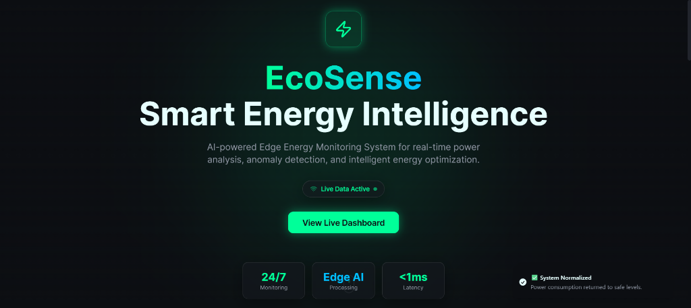
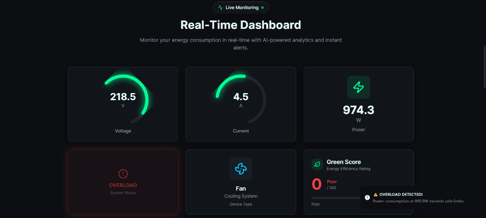
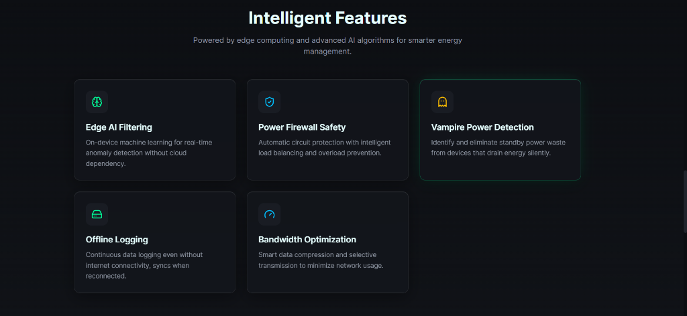
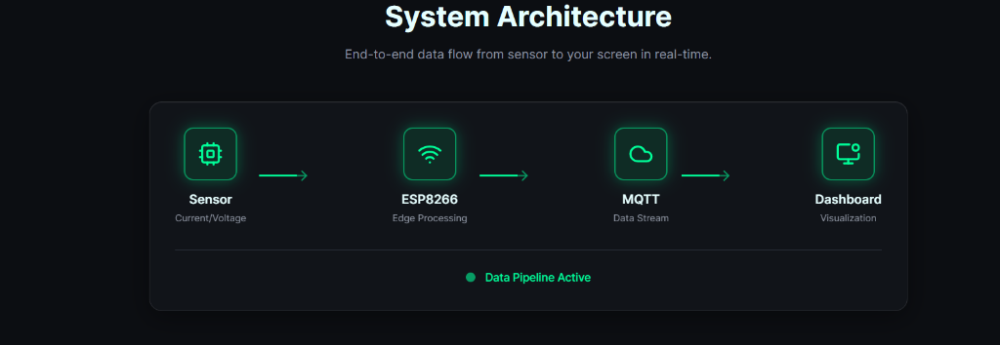

# EcoSense - Edge AI Energy Auditor

EcoSense is a modern, real-time Smart Home Energy Monitor dashboard designed to help users track and optimize their energy consumption. It provides live updates on electrical parameters, cost estimations, and safety alerts through a clean and responsive user interface.

## 🚀 Features

-   **Real-Time Monitoring**: Live display of Voltage, Current, Power, and Energy consumption.
-   **Interactive Dashboard**: Visual gauges and charts for instant status overview.
-   **Cost Estimator**: Estimate daily and monthly energy costs based on consumption.
-   **Live Graphs**: Real-time power consumption trends visualization using Recharts.
-   **Safety Alerts**: Visual indicators for system status and safety warnings.
-   **Bandwidth Saver**: tailored modes for optimized data transmission.
-   **MQTT Integration**: Connects to MQTT brokers for real-time data ingestion from IoT devices (ESP8266).
-   **Responsive Design**: Fully responsive layout built with Tailwind CSS.

## 📸 Dashboard Preview

### Hero Section


### Live Dashboard


### Intelligent Features


### System Architecture


## 🌟 Key Features

### 1. Live Energy Monitoring
Track your electrical parameters in real-time with high-precision radial gauges.
- **Voltage (V)**: Monitors line voltage stability (0-250V range).
- **Current (A)**: real-time current draw monitoring.
- **Power (W)**: Instantaneous power consumption display.

### 2. Intelligent Device Recognition
The system uses AI/ML algorithms at the edge to identify the type of appliance currently running.
- **Device Type**: Displays the detected appliance (e.g., Laptop, Fan, Light).
- **Status Indicator**: Visual feedback on device operational status.

### 3. Green Score & Analytics
Promote eco-friendly habits with the Green Score meter.
- **Green Score**: A dynamic metric indicating energy efficiency.
- **Power Chart**: Interactive graph showing power consumption trends over time.

### 4. Safety & Alerts
- **Visual Alerts**: Color-coded indicators for warning and danger thresholds.
- **System Status**: Real-time connection status with the MQTT broker.

## 🛠️ Tech Stack

-   **Frontend**: React, TypeScript, Vite
-   **Styling**: Tailwind CSS, Shadcn UI
-   **Visualization**: Recharts
-   **State Management**: React Query
-   **IoT Protocol**: MQTT (via `mqtt` library)

## 📦 Installation

1.  **Clone the repository**
    ```bash
    git clone https://github.com/Vigneshwaran2502/ecosense-live.git
    cd ecosense-live
    ```

2.  **Install dependencies**
    ```bash
    npm install
    ```

3.  **Start the development server**
    ```bash
    npm run dev
    ```

## 🔧 Configuration

The application is configured to connect to a public MQTT broker by default. You can modify the MQTT settings in the source code to point to your own broker or change topics.

-   **Data Topic**: `ecosense/data`
-   **Alerts Topic**: `ecosense/alerts`

## 🤝 Contributing

Contributions are welcome! Please feel free to submit a Pull Request.

## 📄 License

This project is open source and available under the [MIT License](LICENSE).
